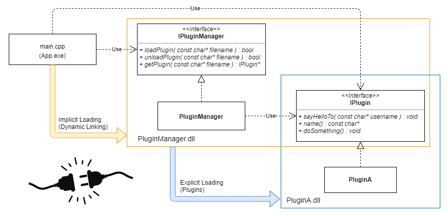

# Plugin Manager

Plugin Manager developed in C++.

## TODO
- [ ] Use CMake
- [ ] Use GitHub actions
- [ ] Add tests
- [ ] Update documentation
- [ ] Add copyright to files
- [ ] Add python plugin
- [ ] Add qt plugin
- [ ] Add render plugins

## Contributing

Pull requests are welcome. For major changes, please open an issue first to discuss what you would like to change.

## License

[MIT](https://choosealicense.com/licenses/mit/)
